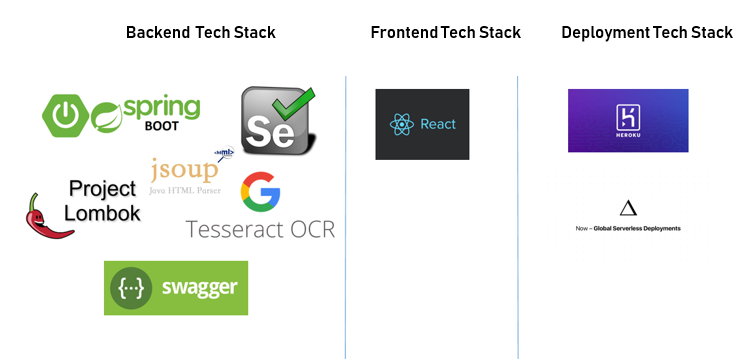
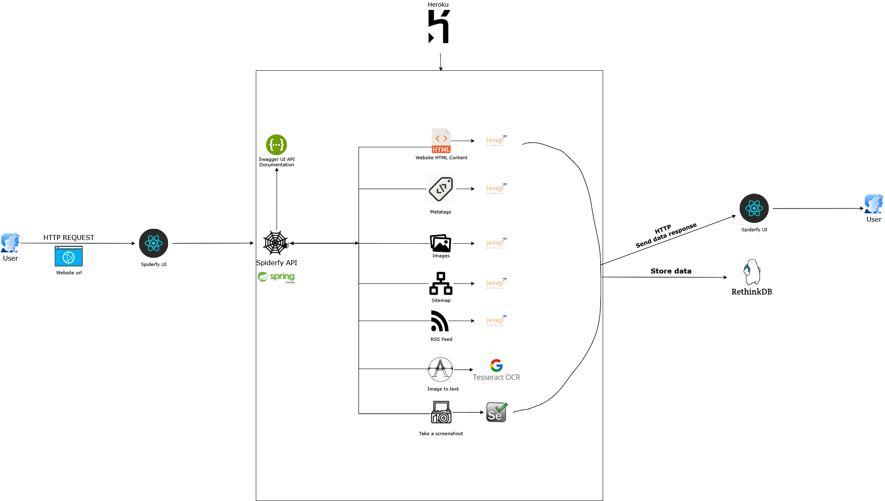

# 🕸🕷FYCrawler UI🦟🕸

#                             TECH STACK

#                             SYSTEM DIAGRAM

**All frameworks and libraries are %100 open source ❤️.**
|Feature Count| Methodology| Description  |
:---------| :------- | :---------------
#1|🕸️Crawl | To retrieve all links from given website. |
#2|🕸️Crawl | To retrieve all images from given website. |
#3|💬NLP| To analyze all words frequencies (NLP) from given website url. |
#4|💬NLP| To analyze specific word frequencies (NLP) from given website url. |
#5|🕸️Crawl| To retrieve all metatags from given website. |
#6|🔖Sitemap - 🕸️Crawl| To retrieve all sitemap nodes from given website. |
#7|🔖Sitemap - 🕸️Crawl| To retrieve all links from given sitemap url. |
#8|🖼OCR| To convert base64 to text (OCR function) from given snapshoot. |
#9|🗳RSS - 🕸️Crawl| To retrieve all RSS Feeds from given RSS url. |
#10|📊Analysis - 📄PDF| To summary all javascript files usage (Content length, file size) from given website. |
#11|🗳RSS - 🕸️Crawl| To retrieve Turkey RSS News Feeds from RSS list. |
#12|📑Static File| To show 3500 user agent from static list. |
#13|🖱 HTTP Request Manipulation| To insert randomly selected user agent on http request according to user agents static list |
#14|🕸️Crawl| To obtain only text without any html tags from given website. |
#15|🕸️Crawl| To obtain only all html source code from given website.|
#16|🌐Selenium| To retrieve all links/link snapshoot on base64 format. |
#17|📊Analysis - 🕸️Crawl| To obtain top 50 sites in Turkey from Alexa. |
#18|📊Analysis - 🕸️Crawl| To obtain top 50 sites in Turkey from SimilarWeb. |
#19|📊Analysis - 🕸️Crawl| To show rank site from Alexa. |
#20|📊Analysis - 📄PDF| To generate pdf output from given website url.|
#21|📊Analysis - 📄PDF| To generate pdf output from given any html. |
#22|📊Analysis | To calculate page load time from given any url. |
#23|🕸️Crawl| To retrieve internal backlinks from given any url.|
#24|🕸️Crawl| To retrieve outgoing backlinks from given any url.|
#25|🕸️Crawl| To generate summary data [Consist of: #1 ,#2, #5, #14, #15, #23, #24] from given website.|
#26|📊Analysis -🕸️Crawl| To generate summary usage of html tags given in website.|

